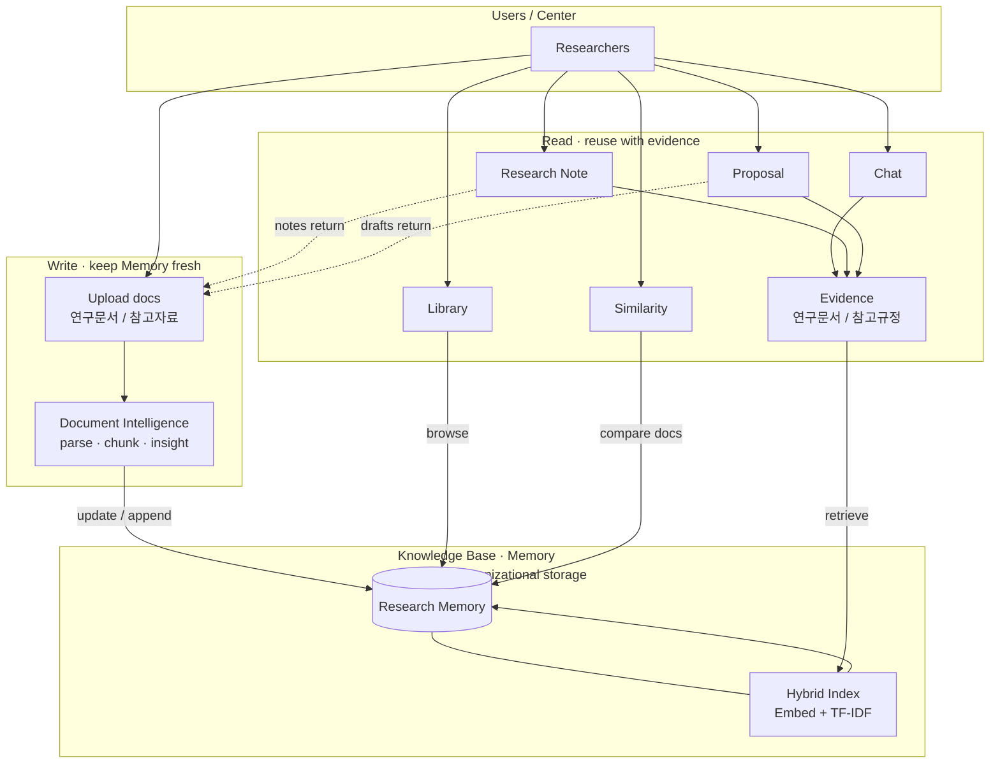

# Research Memory Platform

**An Organizational Research Intelligence Platform**

과거 자료 기반의 지식베이스-> AI가 보관-이해-활용할 수 있도록 하는 시스템

### Goals

1. Enable evidence-based reuse of organizational research assets
2. Preserve and operationalize institutional research knowledge

---

## How it works



지원 형식: PDF, DOCX, TXT/MD, CSV, XLSX, HWPX

검색: Ollama 임베딩(`nomic-embed-text`) + TF-IDF를 **hybrid(RRF)** 로 결합.  
임베딩이 안 되면 TF-IDF만 사용.

---

## UI tabs


| Tab          | 하는 일                                                                             |
| ------------ | -------------------------------------------------------------------------------- |
| **홈**        | Research Memory 대시보드. 최근 문서·빠른 업로드/탐색 진입.                                        |
| **라이브러리**    | 과제 폴더별 문서 탐색·업로드·삭제. 문서 역할(연구문서/참고자료)과 Document Insight.                         |
| **채팅**       | Memory에 질문. 답변마다 출처(파일·위치)와 `[연구문서]`/`[참고규정]` 구분을 붙입니다. 근거가 없으면 거절합니다.           |
| **연구노트**     | 프로젝트 맞춤 연구노트 초안. Memory + 추가자료 참고, 표 미리보기·DOCX/HWPX 다운로드·Memory 저장.              |
| **제안서**      | RFP/공고문을 넣고, **연구문서 + 참고규정(운영요령)** 근거로 센터 파트 초안·준수 포인트를 만듭니다. 전체 제안서 자동완성이 아닙니다. |
| **유사도 검토**   | 새 문서 ↔ Memory(또는 문서끼리) 문장·페이지·이미지를 비교합니다. MiniLM + pHash, 표/페이지 PNG로 중복·재사용 검토. |


Future Capabilities


| Tab         | 하는 일                                                              |
| ----------- | ----------------------------------------------------------------- |
| **과제 일정**   | 과제별 회의·제출·작업·마일스톤을 월간 캘린더로 등록·조회합니다. (알림/외부 캘린더 연동은 미포함) |


---

## Run

```bash
cd /mnt/data/eunbi/research-memory
./run_app.sh
```

브라우저: [http://127.0.0.1:8505](http://127.0.0.1:8505)

---

## Project layout

```
app.py                 UI
research_memory/
  pipeline/            문서 파싱 · 메타/Fact · 인제스트
  kb/                  Knowledge Base
  engine/              Chat · Similarity · Proposal · Schedule · Tracking
                 docsim/  (유사도: MiniLM · 파서 · pHash)
```

