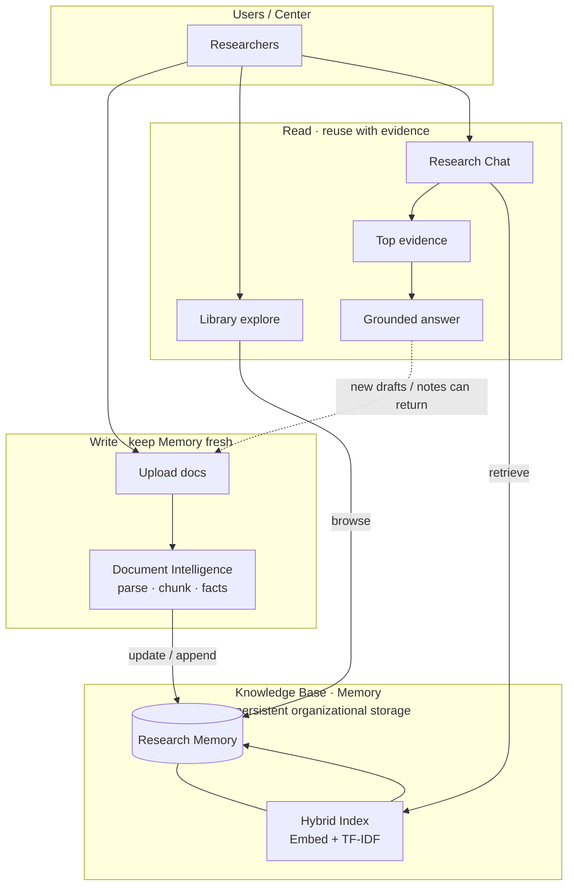

# Research Memory Platform

**An Organizational Research Intelligence Platform**

과거 자료 기반의 지식베이스-> AI가 보관-이해-활용할 수 있도록 하는 시스템

### Goals

1. Enable evidence-based reuse of organizational research assets
2. Preserve and operationalize institutional research knowledge

---

## How it works



지원 형식: PDF, DOCX, TXT/MD, CSV, XLSX, HWPX

검색: Ollama 임베딩(`nomic-embed-text`) + TF-IDF를 **hybrid(RRF)** 로 결합.  
임베딩이 안 되면 TF-IDF만 사용.

---

## UI tabs


| Tab               | 하는 일                                                              |
| ----------------- | ----------------------------------------------------------------- |
| **Research Chat** | Memory에 질문. 답변마다 출처(파일·위치)를 붙입니다. 근거가 없으면 거절합니다.                  |
| **Similarity**    | 새 문서 ↔ Memory (또는 문서끼리) 비슷한 문장을 찾습니다. 중복·재사용 검토용.                 |
| **Proposal**      | RFP/공고문을 넣고, Memory 근거로 **우리 센터 파트 초안**을 만듭니다. 전체 제안서 자동완성이 아닙니다. |
| **Milestone**     | 과제별 예정 산출물과 Memory 문서를 대조합니다. 빠진 것·기한 지난 것을 보여줍니다.                |
| **Ingest**        | 문서를 Memory에 넣습니다. Project ID를 붙이면 과제 단위로 묶입니다.                    |
| **Library**       | 인제스트된 문서 목록을 보고 삭제합니다.                                            |
| **Facts**         | 문서에서 뽑힌 메타/Fact(과제명, 작성자, 수치 등)를 봅니다.                             |


---

## Run

```bash
cd /mnt/data/eunbi/research-memory
./run_app.sh
```

브라우저: [http://127.0.0.1:8505](http://127.0.0.1:8505)

데모 데이터가 필요하면:

```bash
.venv/bin/python -m research_memory.cli seed_demo
.venv/bin/python -m research_memory.cli milestone --seed
```

검색 인덱스 재구축 / 평가:

```bash
.venv/bin/python -m research_memory.cli rebuild-index
.venv/bin/python -m research_memory.cli eval --rebuild
```

---

## Project layout

```
app.py                 UI
research_memory/
  pipeline/            문서 파싱 · 메타/Fact · 인제스트
  kb/                  Knowledge Base
  engine/              Chat · Similarity · Proposal · Tracking
```

