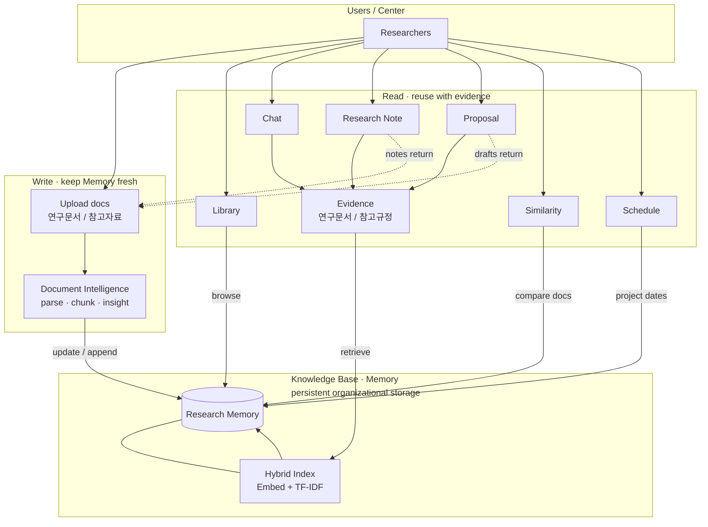

# Research Memory Platform

**An Organizational Research Intelligence Platform**

과거 자료 기반의 지식베이스-> AI가 보관-이해-활용할 수 있도록 하는 시스템

### Goals

1. Enable evidence-based reuse of organizational research assets
2. Preserve and operationalize institutional research knowledge

---

## How it works




지원 형식: PDF, DOCX, TXT/MD, CSV, XLSX, HWPX

검색: Ollama 임베딩(`nomic-embed-text`) + TF-IDF를 **hybrid(RRF)** 로 결합.  
임베딩이 안 되면 TF-IDF만 사용.

---


## UI tabs


| Tab        | 하는 일                                                                                               |
| ---------- | -------------------------------------------------------------------------------------------------- |
| **홈**      | Research Memory 대시보드. 최근 문서·빠른 업로드/탐색 진입                                                           |
| **일정 관리**  | 과제별 회의·제출·작업·마일스톤을 월간 캘린더로 등록·조회(알림 및 외부 캘린더 연동은 [myown](https://github.com/sumin-ma-1/myown)을 참고) |
| **라이브러리**  | 과제 폴더별 문서 탐색·업로드·삭제. 문서 역할(연구문서/참고자료)과 Document Insight                                            |
| **채팅**     | Memory에 질문. 답변마다 출처(파일·위치)와 `[연구문서]`/`[참고규정]` 구분을 붙입니다. 근거가 없으면 거절합니다                              |
| **연구노트**   | 프로젝트 맞춤 연구노트 초안. Memory + 추가자료 참고, 표 미리보기·DOCX/HWPX 다운로드·Memory 저장                                 |
| **제안서**    | RFP/공고문을 넣고, **연구문서 + 참고규정(운영요령)** 근거로 센터 파트 초안·준수 포인트를 만듭니다. 전체 제안서 자동완성이 아닙니다                    |
| **유사도 검토** | 새 문서 ↔ Memory(또는 문서끼리) 문장·페이지·이미지를 비교합니다. MiniLM + pHash, 표/페이지 PNG로 중복·재사용 검토                     |


---


## 일정 관리 사용 흐름

1. **과제 등록** — 일정 관리 > "과제 등록·수정" 펼쳐서 과제 ID·과제명·담당·기간 입력 후 저장
2. **일정 추가** — 캘린더에서 날짜 빈 곳 클릭 → 팝업에서 제목·유형·상태·과제 선택 후 등록
3. **일정 수정** — 일정 칩 클릭 → 팝업에서 수정 후 저장 (완료·삭제도 같은 팝업)
4. **월 이동** — ‹ / › 버튼 또는 "오늘" 버튼
5. **상태 필터** — (전체) / 예정 / 진행중 / 완료

### 현재 범위
- 월간 캘린더 등록·조회·수정·삭제
- 유형: 회의 / 제출 / 작업 / 마일스톤

### 미지원 (참고: [myown](https://github.com/sumin-ma-1/myown))
- 알림·리마인더
- 반복 일정
- 기간(시작~종료) 설정
- 외부 캘린더 연동 (Google Calendar 등)

---

## 데이터 저장

| 경로 | 내용 |
|------|------|
| `data/raw/` | 업로드한 원본 파일 |
| `data/kb/memory.sqlite3` | 문서·과제·일정·인덱스 등 모든 메타데이터 |
| `data/kb/*.pkl` | 검색 인덱스 (TF-IDF, 벡터) |

> `data/`는 `.gitignore`에 포함되어 Git에 올라가지 않습니다.
> 다른 환경에서 실행하면 빈 상태로 시작합니다.

---


## Run

```bash
cd /mnt/data/eunbi/research-memory
./run_app.sh
```

브라우저: [http://127.0.0.1:8505](http://127.0.0.1:8505)

---


## Project layout

```
app.py                 UI
research_memory/
  pipeline/            문서 파싱 · 메타/Fact · 인제스트
  kb/                  Knowledge Base
  engine/              Chat · Similarity · Proposal · Schedule · Tracking
                 docsim/  (유사도: MiniLM · 파서 · pHash)
```

---


## Credits

일정 캘린더 UI와 알림·외부 캘린더 연동은 [myown](https://github.com/sumin-ma-1/myown)을 참고했습니다.