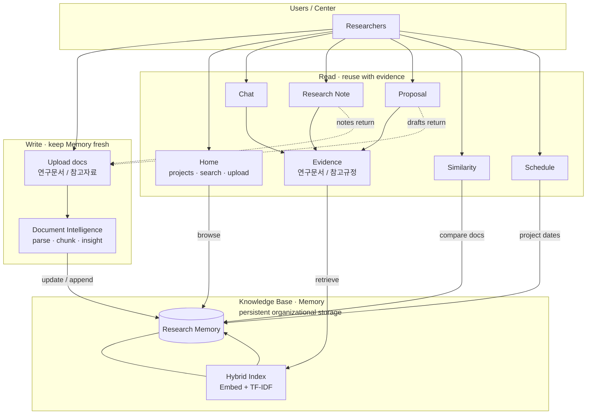

**한국어** | [English](README_EN.md)

# Research Memory Platform

**An Organizational Research Intelligence Platform**

과거 자료 기반의 지식베이스-> AI가 보관-이해-활용할 수 있도록 하는 시스템

### Goals

1. Enable evidence-based reuse of organizational research assets
2. Preserve and operationalize institutional research knowledge

---

## How it works




지원 형식 (문서): PDF, DOCX, TXT/MD, CSV, XLSX, HWP/HWPX  
회의록 녹음: MP3, WAV, M4A, WEBM, OGG, FLAC (연구 기록 · 회의록 모드, 선택적 STT)

검색: Ollama 임베딩(`nomic-embed-text`) + TF-IDF를 **hybrid(RRF)** 로 결합.  
임베딩이 안 되면 TF-IDF만 사용.

---


## UI tabs


| Tab        | 하는 일                                                                                               |
| ---------- | -------------------------------------------------------------------------------------------------- |
| **홈**      | Research Memory 대시보드. 프로젝트·검색·업로드·최근 문서, 문서 상세·역할(연구문서/참고자료)·Document Insight |
| **일정 관리**  | 과제별 회의·제출·작업·마일스톤을 월간 캘린더로 등록·조회(알림 및 외부 캘린더 연동은 [myown](https://github.com/sumin-ma-1/myown)을 참고) |
| **채팅**     | Memory에 질문. 답변마다 출처(파일·위치)와 `[연구문서]`/`[참고규정]` 구분을 붙입니다. 근거가 없으면 거절합니다                              |
| **연구 기록**  | 연구노트·회의록 초안. Memory + 추가자료(회의록은 녹음/트랜스크립트) 참고, 표 미리보기·DOCX/HWPX 다운로드·Memory 저장                     |
| **제안서**    | RFP/공고문을 넣고, **연구문서 + 참고규정(운영요령)** 근거로 센터 파트 초안·준수 포인트를 만듭니다. 전체 제안서 자동완성이 아닙니다                    |
| **유사도 검토** | 새 문서 ↔ Memory(또는 문서끼리) 문장·페이지·이미지를 비교합니다. MiniLM + pHash, 표/페이지 PNG로 중복·재사용 검토                     |


---


## Run

```bash
cd /mnt/data/eunbi/research-memory
./run_app.sh
```

브라우저: [http://127.0.0.1:8505](http://127.0.0.1:8505)

---


## Project layout

```
app.py                 UI
research_memory/
  pipeline/            문서 파싱 · 메타/Fact · 인제스트
  kb/                  Knowledge Base
  engine/              Chat · Similarity · Proposal · Schedule · Tracking
                 docsim/  (유사도: MiniLM · 파서 · pHash)
```

---


## Credits

일정 캘린더 UI와 알림·외부 캘린더 연동은 [myown](https://github.com/sumin-ma-1/myown)을 참고했습니다.