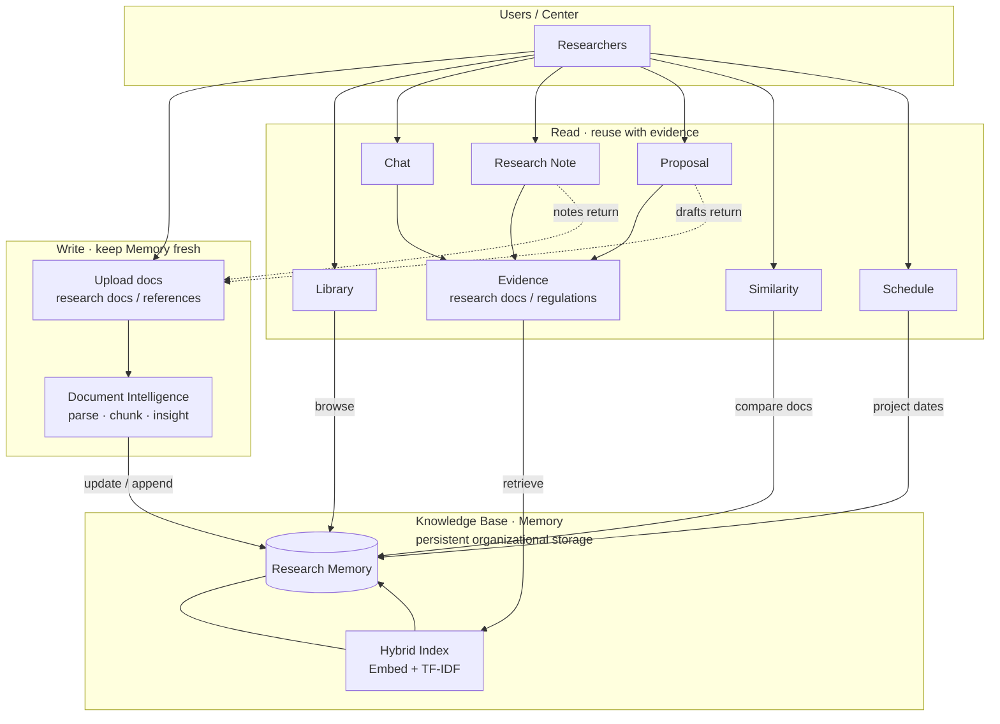

[한국어](README.md) | **English**

# Research Memory Platform

**An Organizational Research Intelligence Platform**

A knowledge base system built on past research assets — enabling AI to store, understand, and reuse institutional knowledge.

### Goals

1. Enable evidence-based reuse of organizational research assets
2. Preserve and operationalize institutional research knowledge

---

## How it works



Supported formats: PDF, DOCX, TXT/MD, CSV, XLSX, HWPX

Search: Ollama embeddings (`nomic-embed-text`) + TF-IDF combined via **hybrid (RRF)** fusion.
Falls back to TF-IDF only when embeddings are unavailable.

---

## UI tabs

| Tab | Description |
| --- | --- |
| **Home** | Research Memory dashboard. Recent documents, quick upload and browse. |
| **Schedule** | Monthly calendar for project meetings, submissions, tasks, and milestones. Click an empty day cell to add, click a chip to edit. (Notifications and external calendar sync are referenced from [myown](https://github.com/sumin-ma-1/myown).) |
| **Library** | Browse, upload, and delete documents by project folder. Assign document roles (research doc / reference) and view Document Insight. |
| **Chat** | Ask questions against Memory. Each answer cites its source (file, location) tagged as `[research doc]` or `[regulation]`. Refuses to answer without evidence. |
| **Research Note** | Draft project-specific research notes. References Memory + uploaded materials. Table preview, DOCX/HWPX download, and save to Memory. |
| **Proposal** | Upload an RFP and generate a center-part draft with compliance points, grounded in **research docs + regulations**. This is not a full proposal auto-generator. |
| **Similarity** | Compare a new document against Memory (or two documents against each other) at the sentence, page, and image level. Uses MiniLM + pHash for duplicate and reuse detection. |

---

## Run

```bash
cd /mnt/data/eunbi/research-memory
pip install -r requirements.txt
./run_app.sh
```

Open in browser: [http://127.0.0.1:8505](http://127.0.0.1:8505)

### Data storage

| Path | Contents |
| --- | --- |
| `data/raw/` | Uploaded original files |
| `data/kb/memory.sqlite3` | All metadata — documents, projects, schedule items, indexes |
| `data/kb/*.pkl` | Search indexes (TF-IDF, vector) |

> `data/` is in `.gitignore` and is **not** tracked by Git.
> Cloning the repo starts with an empty database.

---

## Project layout

```
app.py                 UI (Streamlit)
research_memory/
  pipeline/            Document parsing · metadata/fact extraction · ingest
  kb/                  Knowledge Base (SQLite + hybrid index)
  engine/              Chat · Similarity · Proposal · Schedule · Tracking
                 docsim/  (similarity: MiniLM · parsers · pHash)
```

---

## Credits

Calendar UI and notification/external calendar integration referenced from [myown](https://github.com/sumin-ma-1/myown).
